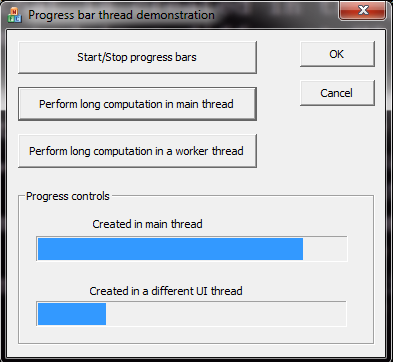

#MFC-threads

Adi Levin, December 2015

This is a small MFC application with a dialog box that has two progress bars in it: A progress control (CProgressCtrl) that is created in the primary thread of the application, and a progress control that is created in a different UI thread.

The goal here is to display a moving progress bar that keeps going even when the primary thread is busy doing a long computation. It is generally better to not do any long computation in the primary thread, and always keep it available for drawing and for recieving input from the user. If there are long computations, they should be performed in worker threads. However, it is sometimes difficult to completely avoid long computations in the primary thread. During the times that the primary thread is busy, we may want to display some kind of animation, indicating that the application is alive, even though it is not responding to user input – this is the purpose of the progress control in a UI thread.

##Instructions
Build the solution using Visual Studio 2013 and run it. You’ll see that there are two progress controls. Use the buttons to start/stop the progress indicator, and to run a long computation in the primary thread or in a worker thread. You’ll notice that one progress bar stops moving when the primary thread is busy, while the other keeps moving. Both progress bar keep moving when the long computation is performed in a worker thread.

##User-Interface threads in MFC

The MFC term “user-interface thread” means a thread with a message queue and message loop that dispatches messages to windows (every control in MFC is a window).

An implementation of a UI thread from scratch requires to implement a complicated message handler, because windows must be able to respond to many messages in order to operate well. The MFC class CWinThread encapsulates the MFC message map, so it saves you the work of writing your own message routing code.

CWinThread can be used to create worker threads and UI threads. Worker threads are just threads that run a given function, not much different from calling CreateThread, so I won’t elaborate on them. I’ll focus on UI threads.

##Implementation details

CProgressCtrlWithTimer inherits from CProgressCtrl. It adds the methods Play(), Stop() and IsPlaying(), that animates the progress control, using a timer. The UI thread is implemented by the class CProgressThread, that inherits from CWinThread. The dialog owns the instance of CProgressThread as a member.

CProgressThread works as follows: It gets as input a CProgressCtrl control, which is used as a reference control, meaning that we dynamically create another control of the type CProgressCtrlWithTimer with the position, style and parent window of the reference control.

The key to make our new control respond to messages in the UI thread, is to create it in the method CProgressThread::InitInstance(), which is invoked in the UI thread, immediately after the thread is created. It is not important where the control is constructed – it is only important that its CreateWindow() method will be from the UI thread and not the main thread.

Notice that the dialog does not interact directly with the control that belongs to the UI thread. To make it Play or Stop, we post a message to the CProgressThread using PostThreadMessage. The message handlers that respond to these messages call the functions Play() or Stop() of the new control, from the UI thread.